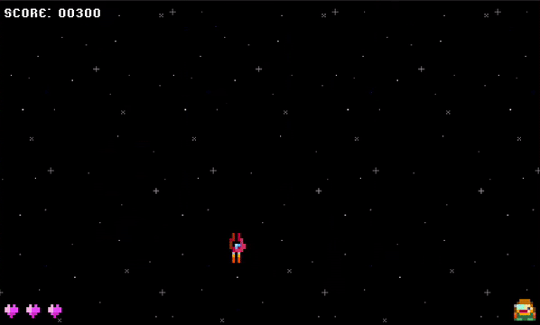

# IF669-Jogo
Projeto da cadeira de Introdução à Programação do CIn-UFPE que visa a criação de um jogo na linguagem C utilizando a biblioteca [raylib](https://www.raylib.com/).

# Sobre
Para o projeto, escolhemos desenvolver um jogo do estilo [shoot ‘em up](https://en.wikipedia.org/wiki/Shoot_%27em_up) que será dividido em 3 fases:
* A primeira fase que registra o começo da aventura do piloto espacial ***Alexandre C. Mota*** na defesa da Terra contra a invasão dos malignos alienígenas do planeta ***C-GPT669***.

<p align="center">
  
</p>

* A segunda fase que mostra o percurso que o piloto ***ACM*** percorre até chegar a nave-mãe dos alienígenas invasores.

<p align="center">
  
</p>

* A terceira face que mostra o combate do piloto com a nave-mãe para destruir o ***Kernel*** e interromper a invasão.

# Desenvolvimento
A estrutura do nosso projeto está segmentada da seguinte maneira:
* A pasta ***dep***, que contém as depêndencias do projeto.
* A pasta ***res***, que contém recursos estáticos como imagens e sons.
* A pasta ***src***, que contém todo código em C do projeto.

# Compilação
Para compilar o projeto em um ambiente ***Linux*** basta abrir o terminal na pasta ***src*** do projeto e executar a linha de comando abaixo:

```
gcc ./main.c ./nave/nave.c ./inimigos/inimigos.c ./colisoes/colisoes.c ./backgrounds/backgrounds.c ./menu/menu.c ./fases/fases.c -o projeto-jogo -I ../dep/include/ -L ../dep/lib/ -lraylib -lGL -lm -lpthread -ldl -lrt -lX11
```
